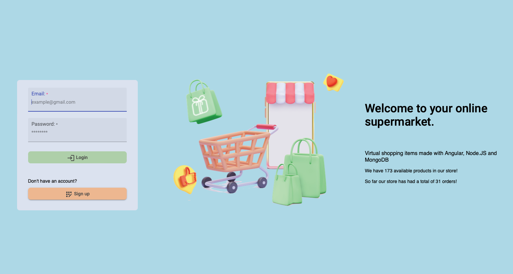
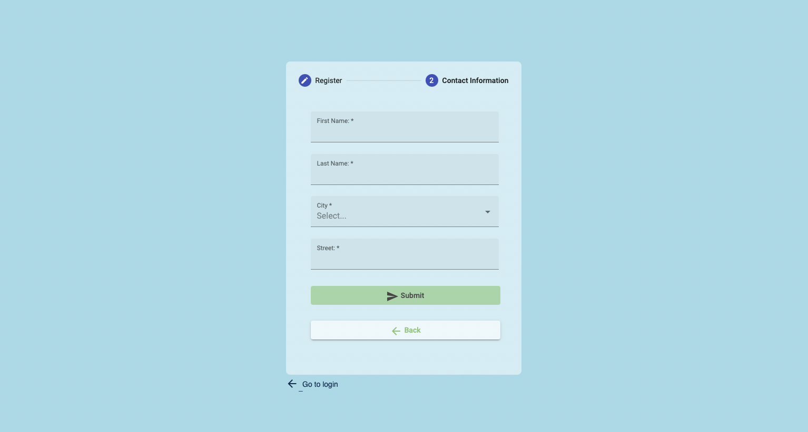
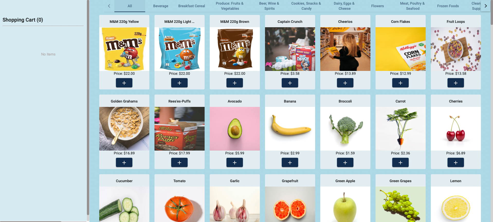
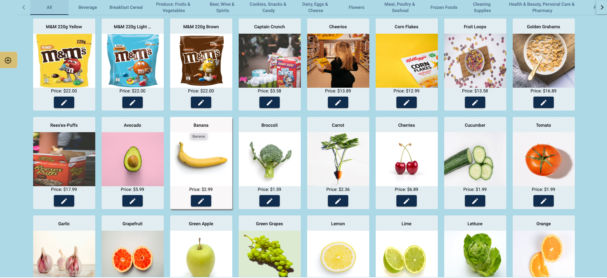

# BuyBuyBuy: Full-Stack Shopping Application

## Overview

**BuyBuyBuy** is a comprehensive full-stack web application for online shopping, designed using **MongoDB**, **Node.js**, and **Angular**. The platform provides features like user registration, shopping cart management, order processing, and an admin interface for managing products and orders. 

## Key Features

- **User Functionality**:
  - Browse products and add to the shopping cart.
  - Manage user profiles and view order history.
  - Secure checkout process with PDF receipt generation.

- **Admin Functionality**:
  - Add, edit, and delete products.
  - Manage user orders and track sales data.

## Dependencies

- **Frontend**: Angular `^14.2.0`
- **Backend**: Node.js, Express.js
- **Database**: NoSQL database using MongoDB.

## Prerequisites

Before running the application, ensure the following are installed:

- Node.js (v14 or later)
- MongoDB (latest version)
- Angular CLI (`npm install -g @angular/cli`)

## Database Setup

Import the database files provided in the `Database` folder into your MongoDB server. Use the following command for MongoDB shell:

```bash
mongoimport --db shopping_db --collection products --file Database/products.json --jsonArray
mongoimport --db shopping_db --collection users --file Database/users.json --jsonArray
```

## Installation Instructions

### Clone the Repository

1. Clone the project and navigate into the directory:

   ```bash
   git clone https://github.com/Pirate-Emperor/BuyBuyBuy.git
   cd BuyBuyBuy
   ```

### Install Dependencies

2. Install required dependencies for the Frontend and Backend:

   ```bash
   cd Frontend
   npm install
   cd ../Backend
   npm install
   ```

## Running the Application

### 1. Start MongoDB Server
Ensure MongoDB is running on your local machine or a specified host.

### 2. Launch the Backend
Run the following commands to start the backend server:

```bash
cd Backend
npm start
```

### 3. Launch the Frontend
Run the frontend application:

```bash
cd ../Frontend
npm start
```

The application will be accessible at:  
**Frontend**: `http://localhost:4200/`  
**Backend API**: `http://localhost:3000/`

## User Information for Login

### Admin Login
- **Username**: `admin@buybuybuy.com`  
- **Password**: `admin123`

### User Login
- **Username**: `user@buybuybuy.com`  
- **Password**: `user123`

## Application Screenshots

### Home Page


### User Registration


### Shopping Page


### Admin Dashboard


## Features Highlighted

- **Product Listing**: Intuitive display of items with filtering and sorting options.
- **Admin Panel**: Easily manage products and orders through a user-friendly interface.
- **PDF Receipt**: Automatically generated upon order completion.
- **Responsive Design**: Optimized for desktop and mobile devices.

## Future Enhancements

- Integration with third-party payment gateways.
- Advanced user analytics and order history insights.
- Multi-language support for a global audience.

## License

This project is licensed under the MIT License. See the [LICENSE](LICENSE) file for details.

## Author

**Pirate-Emperor**

[](https://twitter.com/PirateKingRahul)
[](https://discord.com/users/1200728704981143634)
[](https://www.linkedin.com/in/piratekingrahul)

[](https://www.reddit.com/u/PirateKingRahul)
[](https://medium.com/@piratekingrahul)

- GitHub: [Pirate-Emperor](https://github.com/Pirate-Emperor)
- Reddit: [PirateKingRahul](https://www.reddit.com/u/PirateKingRahul/)
- Twitter: [PirateKingRahul](https://twitter.com/PirateKingRahul)
- Discord: [PirateKingRahul](https://discord.com/users/1200728704981143634)
- LinkedIn: [PirateKingRahul](https://www.linkedin.com/in/piratekingrahul)
- Skype: [Join Skype](https://join.skype.com/invite/yfjOJG3wv9Ki)
- Medium: [PirateKingRahul](https://medium.com/@piratekingrahul)

Thank you for visiting the CipherX project!

---

For more details, please refer to the [GitHub repository](https://github.com/Pirate-Emperor/CipherX).